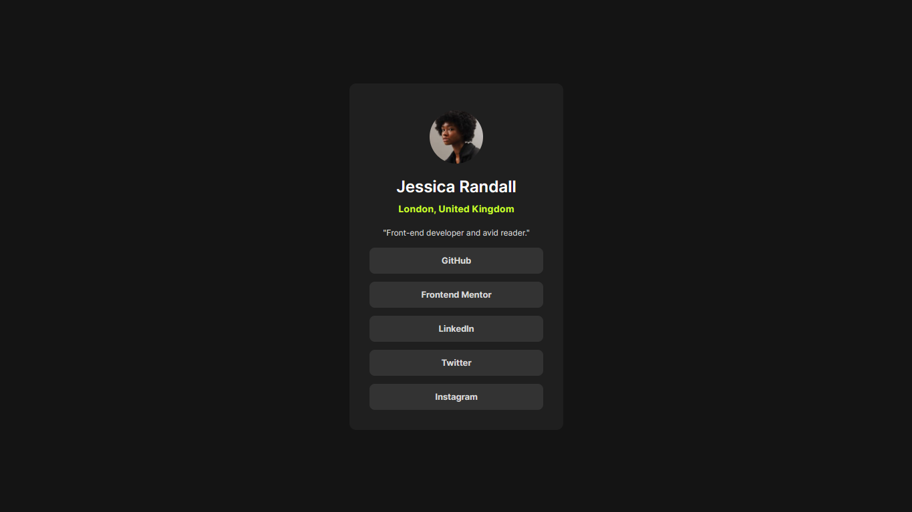

# social-links-profile

Um card simples e moderno de links para redes sociais. Um desafio proposto pela Frontend Mentor

Esta é uma solução para o [Social Links Profile](https://www.frontendmentor.io/challenges/social-links-profile-UG32l9m6dQ)

## Sumário

- [social-links-profile](#social-links-profile)
  - [Sumário](#sumário)
  - [Tabela de Conteúdo](#tabela-de-conteúdo)
    - [Screenshot](#screenshot)
    - [Link da página](#link-da-página)
  - [Meu Processo](#meu-processo)
    - [Feito com](#feito-com)

## Tabela de Conteúdo

### Screenshot

### Link da página

- Live Siste URL: [Social Links Profile]()

## Meu Processo

### Feito com

- Variáveis CSS
- Flexbox
